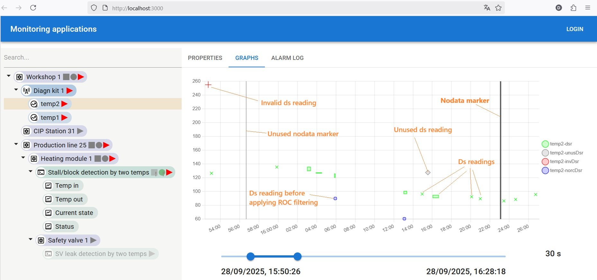
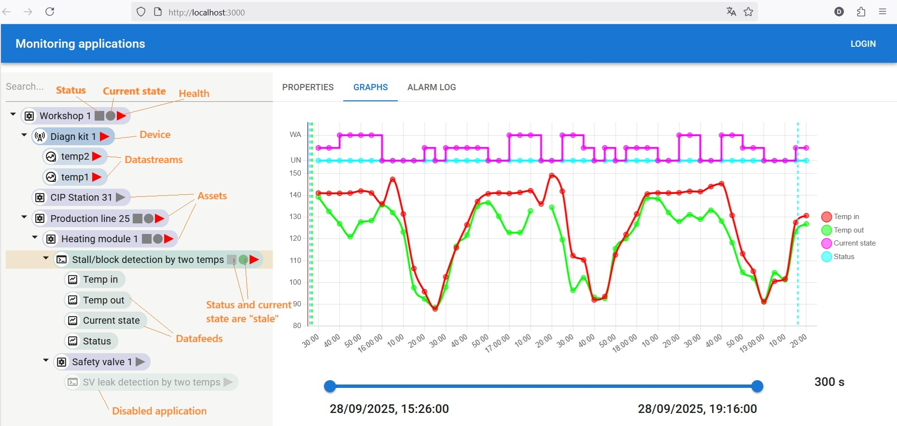

# Monapps V5 - short description

This code is aimed to be run as a backend service on a server. The program receives raw data in a unified format via the MQTT bus (subscription to the topic *rawdata*, see the file `run_mqtt_sub.py`), provides certain kinds of validation (sieves invalid readings, dampens spikes by applying the “rate of change” (ROC, RC) algorithm, and then saves as ***datastream readings***. 



***Datastream readings*** are then used as “fuel” for ***application functions*** to generate insights. First of all, a special procedure called "dfr_creator” creates ordered ***datafeed readings*** that are nailed to rounded timestamps on the ***resampling grid***. It uses different aggregation functions for different variable types. For the continuous type, it is even possible to restore missing readings between adjacent readings if the time between them doesn’t exceed a parameter called *timeChange*. Also, there is an augmenting algorithm for ***datafeed readings*** derived from the readings of so-called “report by exception” datastreams. To say simply, "dfr_creator" tries to do its best to create as many datafeed readings as it can. Ideally, there should be all ***datafeed readings*** for each count on the ***resampling grid***, so that an ***application function*** can calculate output values while moving from one count to another along the ***resampling grid***. These values are called ***derived datafeed readings***, oppositely to ***native datafeed readings*** that are “produced” from ***datastream readings***. Among ***derived datafeed readings***, two are of most interest: ***current state*** and ***status***. They are generated by ***applications*** and used by parent ***assets*** for evaluating their ***current state*** and ***status***, respectively. The third parameter, ***health***, is used to indicate whether a certain instance is performing well or not. ***Health*** is generated by ***devices***, ***datastreams*** and ***applications***, and then is, like the ***current state*** or ***status***, propagated up to the top of the asset tree. While being executed, an ***application function*** is put in the "catching up" state until its ***application cursor*** reaches the point beyond which there are no ***datafeed readings*** at least for one ***datafeed***. At this moment, the ***interval*** attached to the corresponding ***task*** is substituted by a shorter one. ***Health***, ***current state*** and ***status*** are "frozen" to prevent the parent ***assets*** parameters from frequent recalculating by ***update procedures***.



There are several update procedures for ***datastreams***, ***devices*** and ***assets***, which are executed at a certain periodicity. All the changes coming from ***applications*** and ***update functions*** (actually, Celery tasks) are then published on MQTT on the topic *procdata*.

In version 5 the augmentation, restoration and catch-up algorithms are improved.

## Setup
* Download the project from Github
* Rename the `.example` files in the folder `docker/dev/env`  by removing `.example` from their names.
* Replace all the variables in `<>` with your own values. Use the same vakue for `POSTGRES_DB` and `POSTGRES_USER`. When generating a Django `SECRET_KEY` use the set of commands 
```shell
python manage.py shell
from django.core.management.utils import get_random_secret_key
print(get_random_secret_key())
```
You can alternatively use online resources like `https://djecrety.ir/` or `https://django-secret-key-generator.netlify.app/`.

## Start 
* Start Docker compose for the first time with the flag `--build`

```shell
docker compose up -d --build
```
To stop the bundle, execute

```shell
docker compose down
```

Later, you can start and stop the containers with the commands 

```shell
docker compose -f <file_name>.yml start
docker compose -f <file_name>.yml stop
```
If you don't need the Chirpstack, you can start the `mosquitto` container first, 

```shell
docker compose -f mosquitto.yml up -d --build
```
and then start the `monapps` bundle by executing

```shell
docker compose -f monapps-dev.yml up -d --build
```

In this case, you can post new datastrean readings by using the terminal in the `mosquitto` container. The command could look like this:

```shell
mosquitto_pub -t "rawdata" -m '{"0123456789abcdef": {"1759079024966": {"temp1": {"v": 110.1}, "temp2": {"v": 108.6}}, "1759079493999": {"temp1": {"v": 123.3, "e":{"CPU Error": {"st": "in"}}}, "temp2": {"v": 120.8}}}}'
```
Alarms, besides being reflected in the alarm log, are used (errors) to form no data markers for ***RBE datastreams***. Read about the logic in the comments in `alarm_utils.py`.

`NOTE`: If you need to make manipulations in the database, you can use the ORM and the command
```shell
python manage.py shell
``` 
or any other command that can be found in the Django documentation. Use the `monapps-beat` container for this purpose. In Docker Desktop, chose `Open in terminal` and execute the command there.

* When all the containers are running, log in to the web application at `your_host_ip:5000`. It will bring you to the admin panel. Log in to it using the credentials you previously put in the .env file.
* The database will be prepopulated with some items. There will be a couple of ***assets*** to see the ***status***/***current state*** propagation in action. Additionally, there is the application `SV leak detection by two temps`, four ***datafeeds***, and the ***task*** `App 1 Task` attached to the application. The source of data for the application is the device `Diagn kit 1` with two ***datastreams***, `temp1` and `temp2`. There is also the ***application*** `Stall/block detection by two temps`, which can also be used - just assign all ***datafeeds*** and the ***task*** to it, or create new ***datastreams*** and ***datafeeds***. All these items are disabled; you need to enable them by changing the `Is enabled` checkbox in the admin. But first, it is necessary to connect wireless devices to `Chirpstack`.
* Go to `your_host_ip:8080` and log in to Chirpstack. Provided that a LoRaWAN gateway with LoRa Packet Forwarder is connected to the PC that runs Docker, find the ID of this Packet Forwarder instance. In Chirpstack, open the `Gateways` tab and create a new gateway with the same ID. If everything is done correctly, in a couple of minutes, it should become `online` (green) in Chirpstack.
* Then add a `Device profile`. It would require, among other things, adding a proper uplink codec. In this bundle, you can find an uplink codec for “Enless diagnostic kits” in the folder `chirpstack_codecs` (the downlink codec is not finished and, at the moment, is represented as a stub in this file). Copy the content of this file, choose `Custom JS codec` in Chirpstack, and paste all this code there. Then, create an `Application` and create a diagnostic kit item there. Remember its `DEV EUI`, it will be used in `Monapps`.
* In `Monapps`, replace the string in the input `dev ui` of `Device 1 Diagn kit 1` with this `DEV EUI`and then save.
* Go to the application that you are going to use and set up the `cursor ts` field. Use a UNIX timestamp in ms, it should be very close to the current moment. Use JS and `console.log((new Date()).getTime());`.  
* Now that the connection between the diagnostic kit and Monnaps is established, you can enable the items one by one. First, enable datastreams (so that the ***health*** is evaluated). Then enable the task. When the task is enabled, the ***health*** of the application is evaluated even if the application itself is off. And lastly, enable the application. It will start evaluating, and the values of ***status***/***current state***  will change after a certain time.
* You can see the results of the evaluation by hitting the API, for instance, `your_host_IP:5000/api/dfreadings/1/`. Also, it is possible to use the frontend app (at the moment, it works with a limited amount of datafeed readings).

## Auxiliary repositories

There are a couple of auxilliary repositories that may come in handy when getting familiar with the project:
* https://github.com/DmytroIE/MonappsSimulator It is a simulator that helps developing ***application functions***. Can provide a good graphical representation of the charts for ~100-150 ***resampling grid***, which is enough to test the basic logic. It repeats the code related to ***application functions*** execution from this repository.
* https://github.com/DmytroIE/MonappsFront It is a frontend app for representing the results of both ***application functions*** and ***update functions***. It also comprises an MQTT client subscribed to the `procdata` topic, so all the changes in the ***health***, ***current state***, and ***status*** are reflected in the app immediately. It has never been tested with huge volumes of data, but for most of cases it works fine.
* https://github.com/DmytroIE/MonappsAzure A small application that is also subscribed to the `procdata` topic, but it is interested only in new ***datafeed readings***. When new readings are created, it fetches them via an HTTP request, repacks them, and sends them to Azure IoT Hub. When a new ***datafeed*** is created, the program adds it to the database automatically.
* https://github.com/DmytroIE/IrregDataResampling/blob/main/Chapter2.ipynb A bit spontaneous and clumsy notebook, but it explains why we need at least 4 points for starting spline interpolation and why the "pchip" interpolation method is the best for the restoration based on *timeChange*.

## What is to be done next?

* The ***asset update*** algorithm is very naive. Yes, it builds an asset tree and starts from the leaves, but it doesn't take into account the nesting level when assigning net time to the update. It is possible to improve this.
* There are no such instances like ***alarm log*** and ***application log***. They are implemented in a simplified way in the `simulator` (see above), but they are not present in this bundle. The main reason for introducing both such instances is that the alarms and messages generated by ***application functions*** are mostly in a time domain different from the current time. Just imagine that now is 25.10.2025 13:47:56+00, but the app function is dealing with the data from July 2025 (as this is not a real-time system, it may deal with data from the past or delayed data). So, the app function can generate a warning like "Temperature is high" with the timestamp 10.07.2025 25:37:00, but this calculation is taking place in October, as can be seen from the initial timestamp. Values of ***status*** and ***current state*** generated by ***application functions*** always belong to that "application time domain", while ***health*** and statuses of ***assets*** are always in the "real-time" domain. That's why "staleness" of ***status*** and ***current state*** of an ***application*** was introduced as it acts as a bridge between these time domains. ***Devices*** and ***datafeeds*** probably also need their own log as they may receive data "from the past".
* Utilizing the whole power of `Timescale`. At the moment, no data compression for ***datastream readings*** and ***datafeed readings*** is enabled. It will be necessary to add a columnstore policy and segmentation. Read the documentation for `Timescale` for further information.
* Using `unicorn` instead of the dev server.
* Many other points to bring it to the production conditions. 